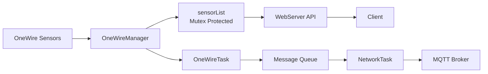
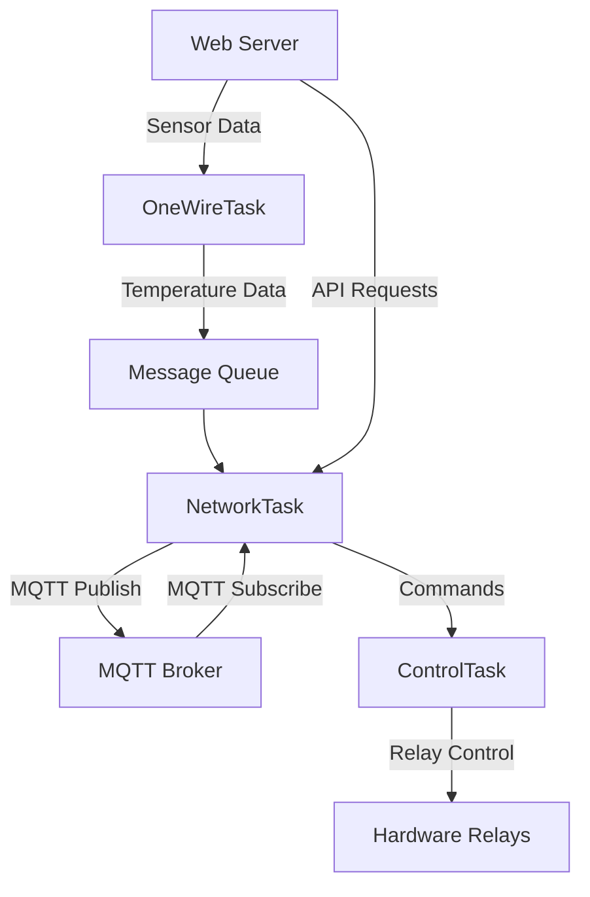

# SensorHub: Smart, Scalable & Resilient Temperature Monitoring for Your IoT Ecosystem

Welcome to SensorHub, the ultimate ESP32-based platform designed to make 
temperature monitoring and control effortless, intelligent, and highly adaptable. 
Whether you’re managing a home automation setup, an industrial environment, or an IoT lab,
SensorHub delivers real-time insights, seamless integration, and robust reliability—all in one compact solution.


## Why Choose SensorHub?

✅ **Plug & Play Efficiency** – Supports multiple One-Wire temperature sensors on a single bus, dynamically detecting new devices without disruption.  

✅ **Seamless Integration** – Auto-discovers sensors in Home Assistant, publishes efficient telemetry to ThingsBoard, and enables smooth relay control.  

✅ **Rock-Solid Reliability** – Built on FreeRTOS with Watchdog protection, ensuring stability and resilience in mission-critical applications.  

✅ **Multi-Platform Data Access** – View sensor data through an embedded web server or control relays via MQTT messaging.  

✅ **User-Friendly & Scalable** – From a single sensor to a full-fledged network, SensorHub scales effortlessly, making it the perfect fit for both beginners and advanced users.  

Built for Performance, Designed for Versatility

With SensorHub, you’re not just monitoring temperature—you’re optimizing control and enhancing automation. Whether it’s for smart home projects, industrial IoT, or scientific applications, our platform empowers you with secure, efficient, and scalable sensor management.

Get ready to transform your IoT experience with SensorHub—where smart monitoring meets next-level innovation. 🚀

## Table of Contents
- [Key Features](#key-features)
- [Architecture Overview](#architecture-overview)
- [Data Flow](#data-flow)
- [Core Components](#core-components)
- [Web API Reference](#web-api-reference)
- [Setup](#setup)
- [Troubleshooting](#troubleshooting)
- [Future Improvements](#future-improvements)
- [License](#license)
- [MQTT Structure](#mqtt-structure)
- [Version] (#version)
## Key Features

- **Real-Time Monitoring and Control**:
  - Collects and processes data from multiple DS18B20 temperature sensors on a single OneWire bus.
  - Provides relay control via MQTT messages or a web interface.
  
- **Thread-Safe and Dynamic**:
  - Uses FreeRTOS mutexes for secure, concurrent access to sensor data.
  - Dynamically detects sensors added to or removed from the bus.

- **Web and MQTT Integration**:
  - Hosts a non-blocking web server for data and control endpoints.
  - Publishes sensor data and receives commands via MQTT.

- **Robust Design**:
  - Built with FreeRTOS and Watchdog guards for reliability.
  - Logs critical events like mutex failures and invalid sensor data.

- **handles both ThingsBoard and Home Assistant MQTT patterns**:
 - A unified DualMQTTPublisher class that handles both ThingsBoard and Home Assistant MQTT patterns
 - Automatic Home Assistant MQTT discovery
 - Efficient JSON handling using ArduinoJson
 - Memory-efficient topic caching
 - Support for both temperature sensors and relays


## Architecture Overview

### Web Server (WebServer.cpp)
- Serves static files and manages API endpoints:
  - `/api/sensors`: Lists sensors and temperature readings.
  - `/api/relays`: Controls and reports relay status.
  - `/api/status`: Returns system health and diagnostics.

- Built on AsyncTCP and AsyncWebServer libraries for efficient, non-blocking I/O.

### OneWire Manager (OneWireManager.cpp)
- Manages DS18B20 temperature sensors:
  - Scans, maintains, and updates a dynamic sensor list.
  - Provides thread-safe access to sensor data using FreeRTOS mutexes.
- Exposes API methods like `getSensorList()` for other modules.


# Data Flow

1. Sensor Data Collection
	•	The OneWireManager scans for connected sensors using sensors.getDeviceCount() and sensors.getAddress().
	•	Temperature readings are requested using sensors.requestTemperaturesByAddress() and read via sensors.getTempC().
	•	The sensor list and readings are stored in a thread-safe data structure (sensorList), guarded by a FreeRTOS mutex.

2. API Requests
	•	A client sends an HTTP GET request to an API endpoint (e.g., /api/sensors).
	•	The web server calls the getSensorList() method from OneWireManager.
	•	Sensor data is serialized into JSON using ArduinoJson and sent back to the client.

3. Static File Serving
	•	The root path (/) serves static files (e.g., a front-end dashboard) from the SPIFFS filesystem.

### Data Flow Diagram

The following diagram illustrates how data moves through the system, from sensors to the web server and MQTT broker:


## Core Components

1. **Task System**
   - `NetworkTask`: Handles MQTT communication and network connectivity
   - `OneWireTask`: Manages temperature sensor readings
   - `ControlTask`: Handles relay control and system logic

2. **Managers**
   - `OneWireManager`: Interfaces with DS18B20 temperature sensors
   - `PreferencesManager`: Handles persistent settings storage
   - `SystemHealth`: Monitors system metrics and health

3. **Communication**
   - MQTT for external communication
   - Internal message queues between tasks
   - Web server for configuration and monitoring

### Data Flow



## Web API Reference

The SensorHub exposes several RESTful APIs for interacting with the system. All APIs use JSON for request and response payloads.

### Authentication

All API endpoints except `/login` require a valid JWT token obtained through authentication. 
The token should be included in the `Authorization` header as a Bearer token:

```
Authorization: Bearer <token>
```

### Endpoints

#### Authentication
- `POST /api/login`
  - Authenticates user and returns JWT token
  - Body: `{"username": "string", "password": "string"}`
  - Response: `{"token": "string"}`

- `POST /api/logout` 
  - Invalidates current token
  - Requires authentication
  - No request/response body

#### Sensors
- `GET /api/sensors`
  - Returns list of all temperature sensors and their current readings
  - Requires authentication
  - Response:
    ```json
    {
      "sensors": [
        {
          "id": "string",
          "address": "string",
          "name": "string",
          "temperature": number,
          "valid": boolean,
          "lastUpdate": number
        }
      ]
    }
    ```

#### Relays
- `GET /api/relays`
  - Returns current state of all relays
  - Requires authentication 
  - Response:
    ```json
    {
      "relays": [
        {
          "id": number,
          "state": boolean,
          "name": "string"
        }
      ]
    }
    ```

- `POST /api/relays`
  - Controls relay state
  - Requires authentication
  - Body: 
    ```json
    {
      "relay": number,
      "state": boolean
    }
    ```
  - Response: Same as GET /api/relays

#### System Preferences 
- `GET /api/preferences`
  - Returns system configuration
  - Requires authentication
  - Response:
    ```json
    {
      "mqtt": {
        "broker": "string",
        "port": number,
        "username": "string"
      },
      "sensors": {
        "sensorId": "sensorName",
        ...
      },
      "display": {
        "brightness": number,
        "selectedSensor": "string"
      }
    }
    ```

- `POST /api/preferences`
  - Updates system configuration
  - Requires authentication
  - Body: Same structure as GET response
  - Response: Same as GET

#### System Status
- `GET /api/status`
  - Returns system health metrics
  - Requires authentication
  - Response:
    ```json
    {
      "uptime": number,
      "freeHeap": number,
      "mqttConnected": boolean,
      "lastError": "string"
    }
    ```

### Error Responses

All endpoints may return the following error responses:

- 400 Bad Request: Invalid request parameters
- 401 Unauthorized: Missing or invalid authentication
- 403 Forbidden: Valid authentication but insufficient permissions
- 500 Internal Server Error: Server-side error

Error response body:
```json
{
  "error": "string",
  "message": "string"
}
```

## Setup

1. **Hardware Requirements**:
   - ESP32 microcontroller with a OneWire-compatible pin.
     The Olimex ESP32 EVB board is a perfect solution, pin4 of the UEXT connector can be used for OneWire.
   - DS18B20 temperature sensors on a OneWire bus.
   - Pull-up resistor for proper operation.

2. **Software Requirements**:
   - Arduino IDE or PlatformIO.
   - Libraries:
     - AsyncTCP
     - ESPAsyncWebServer
     - ArduinoJson

3. **Configuration**:
   - Update `Config.h` with the correct pin numbers and timeouts.

4. **Deployment**:
   - Flash the firmware to the device.
   - Access the web interface via the device's IP address.

## Troubleshooting

### No Sensors Detected
- Verify sensors are correctly connected to the OneWire bus.
- Ensure the pull-up resistor is properly installed.

### API Returns 0 Sensors
- Check logs for errors like "Failed to take mutex."
- Increase the mutex timeout in `OneWireManager.cpp`.

### `_poll(): pcb is NULL`
- Ensure connections are properly closed after handling requests.
- Reduce the number of simultaneous client connections.

### Debugging Tips
- Enable verbose logging in the Logger module.
- Monitor system load and network traffic to identify bottlenecks.

## Future Improvements
- Preferences pages auto refresh disable, it hinders filling the form.
- Implement asynchronous temperature conversion to reduce blocking.
- Add support for additional sensor types.
- Optimize memory usage for larger sensor arrays.

## License

BSD 3-Clause License (Modified)

## MQTT structure

SensorHub implements a sophisticated dual-protocol MQTT architecture that simultaneously supports both ThingsBoard and Home Assistant MQTT patterns. This enables seamless integration with multiple IoT platforms while maintaining efficient communication.

### Home Assistant Integration

The system implements Home Assistant's MQTT Discovery protocol, enabling automatic device configuration:

```
homeassistant/
├── sensor/
│   ├── sensorhub_device1_sensor1/
│   │   ├── config           (discovery configuration)
│   │   ├── state           (current temperature)
│   │   └── attributes      (metadata, status, names)
│   └── sensorhub_device1_babelsensor/
│       ├── config
│       ├── state
│       └── attributes
└── switch/
    └── sensorhub_device1_relay1/
        ├── config
        ├── state           (ON/OFF)
        ├── set            (control topic)
        └── attributes
```

### ThingsBoard Integration

ThingsBoard telemetry is handled through efficient batched JSON payloads:

```
v1/devices/me/
├── telemetry        (batched sensor data)
└── attributes       (device metadata)
```

### Key Features

- **Auto-Discovery**: Devices automatically appear in Home Assistant with proper names, icons, and capabilities
- **Efficient Batching**: Sensor data is batched into single JSON payloads for ThingsBoard
- **Dual Protocol**: Simultaneously publishes to both platforms without redundancy
- **Persistent Topics**: Uses retained messages for reliable state recovery
- **Rich Metadata**: Includes detailed device information and attributes
- **Command Support**: Handles relay control commands from both platforms

### Special Features

#### BabelSensor Virtual Device

The BabelSensor feature allows dynamic remapping of any physical sensor to a virtual sensor endpoint. This enables:
- Remote displays to follow any selected sensor
- Flexible sensor routing without physical rewiring
- Integration with projects like the remote_NTP_clock_display_for_sensorHUB

On the preferences page is a selector to send one of the sensors data ta a virtual sensor.
This allows for other devices to follow this sensor. The virtual sensor is named: BabelSensor.
Another relatad project: remote_NTP_clock_display_for_sensorHUB looks for this sensor and displays it's value.
(https://github.com/MYBLtd/remote_NTP_clock_display_for_sensorHUB)
 
The project defined some alias names for use cases like this:
- The Babel Sensor – Magically translates whatever sensor the user selects.
- SensaThing™ – Vaguely important. Does… something. The marketing team is still working on it.

Some more for your own project:
- Schrödinger’s Sensor – You don’t know what it’s showing until you subscribe. I guess 
  this is a nice one to code ;-) 
- The Hitchhiker’s Guide to Telemetry – Now with 100% less panic.
- The Pan-Galactic Data Blaster – Packs a punch, best enjoyed with a towel in hand.
- The Infinite Improbability Feed – Somehow always displays the right sensor, against all logic.

## version
Current version: `1.3.2`  
See [CHANGELOG.md](CHANGELOG.md) for details.
